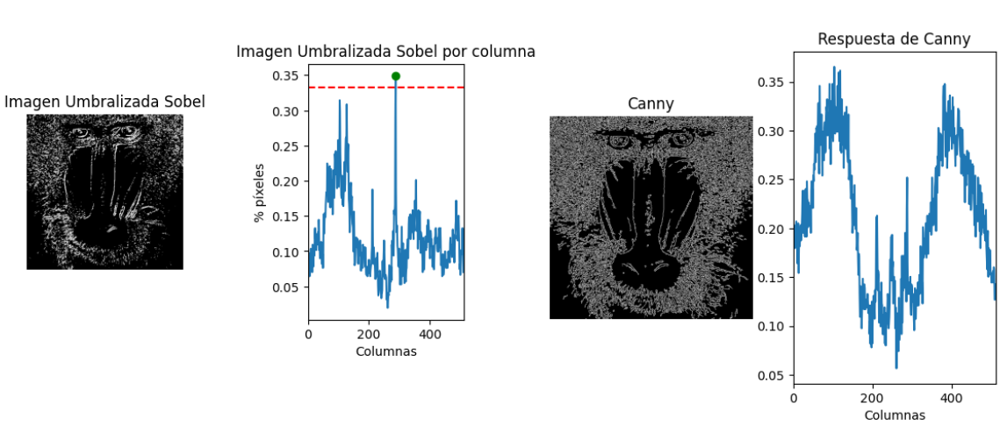
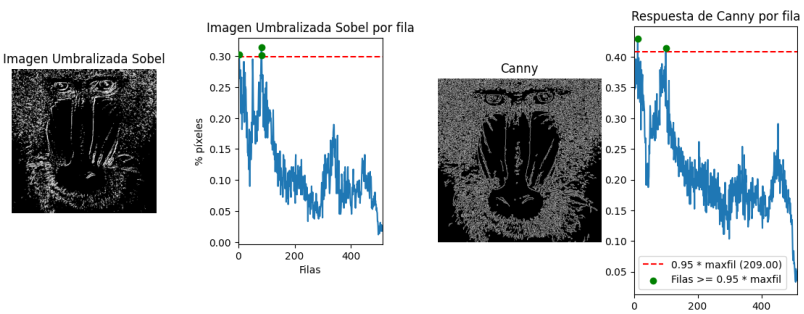
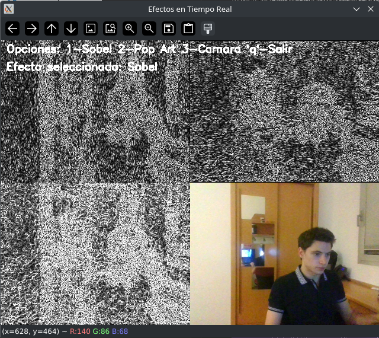
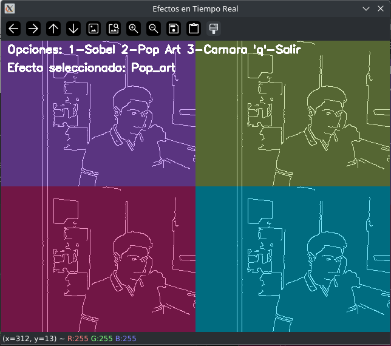
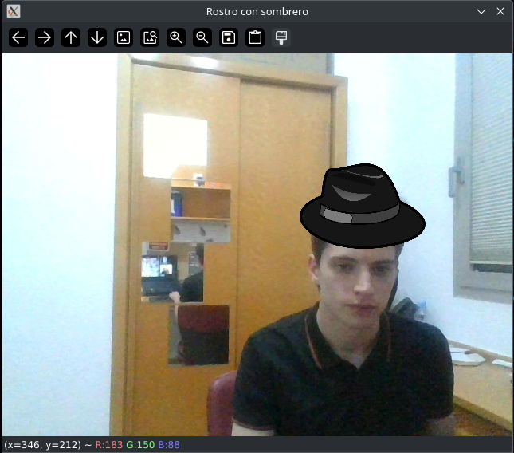
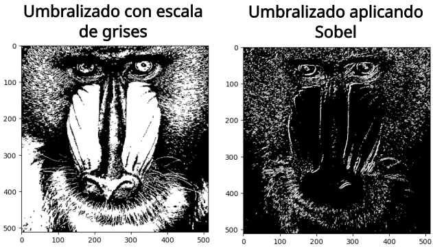
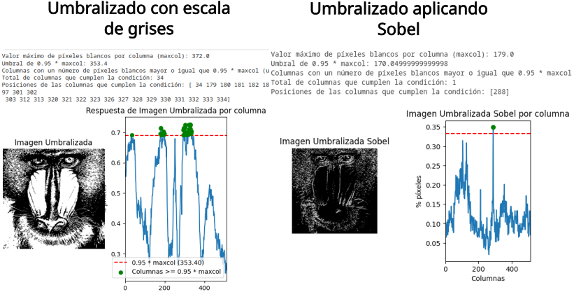
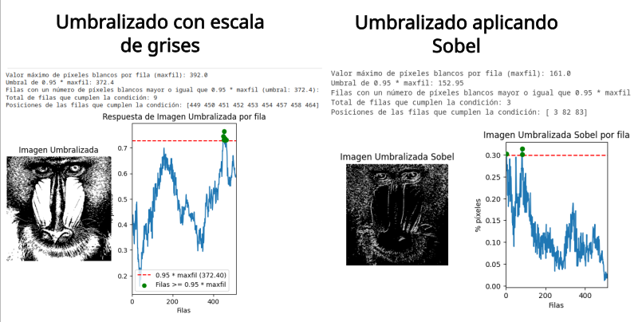

# Práctica 2. Funciones básicas de OpenCV

## Marcos Miguel Sánchez Antonio

### 1-TAREA: Realiza la cuenta de píxeles blancos por filas (en lugar de por columnas). Determina el máximo para filas y columnas (uno para cada) y muestra el número de filas con un número de píxeles blancos mayor o igual que 0.95*máximo.

En este apartado se propone un código el cual realiza el análisis de una imagen procesada por el filtro de Canny, con el objetivo de identificar las filas con mayor cantidad de píxeles blancos (píxeles con valor 255) y visualiza los resultados de forma gráfica.

#### Funcionamiento

1. **Cálculo del número de píxeles blancos por fila**:  
   Se utiliza la función `cv2.reduce` para sumar los valores de los píxeles por cada fila en la imagen `canny`. Esto permite obtener el número total de píxeles blancos (valor 255) por fila. La suma se divide entre 255 para obtener el conteo real de píxeles blancos en cada fila.

2. **Cálculo del valor máximo de píxeles blancos por fila**:  
   Se determina el número máximo de píxeles blancos encontrados en una fila de la imagen.

3. **Filas con más del 95% del valor máximo**:  
   Se define un umbral del 95% del valor máximo de píxeles blancos por fila y se identifican las filas que cumplen o superan este umbral.

4. **Visualización de los resultados**:  
   Se genera una gráfica que muestra el porcentaje de píxeles blancos en cada fila. En esta gráfica, se resaltan las filas que tienen al menos el 95% del máximo número de píxeles blancos, utilizando una línea discontinua roja y marcadores verdes en las filas que cumplen con esta condición.

### 2-TAREA: Aplica umbralizado a la imagen resultante de Sobel (convertida a 8 bits), y posteriormente realiza el conteo por filas y columnas similar al realizado en el ejemplo con la salida de Canny de píxeles no nulos. Calcula el valor máximo de la cuenta por filas y columnas, y determina las filas y columnas por encima del 0.95*máximo. Remarca con alguna primitiva gráfica dichas filas y columnas sobre la imagen. ¿Cómo se comparan los resultados obtenidos a partir de Sobel y Canny?

Sobel es un operador basado en gradientes que resalta las áreas de cambio de intensidad en una imagen, como los bordes. Utiliza filtros de convolución que calculan las derivadas en las direcciones horizontal y vertical, lo que permite detectar los cambios de brillo. Aunque es útil para identificar variaciones suaves en la intensidad, tiende a producir bordes menos precisos y más difusos.

Canny, por otro lado, es un método más avanzado para la detección de bordes. Primero reduce el ruido en la imagen usando un filtro gaussiano, luego identifica los bordes detectando gradientes, y finalmente aplica un proceso de "non-maximum suppression" para eliminar detecciones no deseadas. Este enfoque lo hace más preciso, logrando contornos más nítidos y definidos.

#### Sobel vs Canny:

La imagen procesada con Canny muestra bordes más nítidos y detallados, capturando mejor los contornos principales del objeto. Esto se refleja en la gráfica, donde se detecta un mayor porcentaje de píxeles por fila, alcanzando hasta el 40%. En cambio, Sobel produce bordes más suaves y difusos, con un menor porcentaje de detección, llegando al 30%. La diferencia clave entre ambos es que Canny resalta mejor los bordes definidos, mientras que Sobel es más adecuado para identificar gradientes suaves.




### 3- TAREA: Proponer un demostrador que capture las imágenes de la cámara, y les permita exhibir lo aprendido en estas dos prácticas ante quienes no cursen la asignatura :). Es por ello que además de poder mostrar la imagen original de la webcam, incluya al menos dos usos diferentes de aplicar las funciones de OpenCV trabajadas hasta ahora.

Para el demostrador se ha creado una aplicación en tiempo real utilizando la cámara web para capturar imágenes y aplicar diferentes efectos utilizando OpenCV. Se muestran dos efectos: el filtro Sobel y un efecto de Pop Art. El usuario puede alternar entre estos efectos en tiempo real mientras se visualiza el video de la cámara.

#### Funcionamiento

1. **Captura de video en tiempo real**:  
   El programa utiliza la cámara web (o un archivo de video si se configura) para capturar cuadros en tiempo real.

2. **Filtro Sobel**:
   - Se aplica un filtro Sobel para detectar bordes en las direcciones X y Y.
   - Los bordes detectados en ambas direcciones se combinan y se muestra un collage que incluye los bordes detectados por el filtro en los ejes X, Y, la combinación de ambos, y el cuadro redimensionado original.
   
3. **Efecto Pop Art**:
   - Se aplica el algoritmo de detección de bordes Canny y luego se utilizan diferentes esquemas de color para crear un efecto tipo "Pop Art".
   - Se muestran cuatro versiones del cuadro con diferentes combinaciones de color en un collage 2x2.

4. **Interacción con el usuario**:
   - El programa permite cambiar entre los dos efectos (Sobel y Pop Art) presionando las teclas '1' y '2', respectivamente.
   - Si se presiona la tecla 'q', el programa termina y se cierra la ventana de visualización.





#### Requisitos:
- OpenCV (`cv2`)
- Numpy (`numpy`)

#### Ejecución:
El programa se ejecuta con una cámara web conectada y muestra los efectos en tiempo real en una ventana de video. Para cambiar entre efectos, el usuario debe presionar las teclas '1' o '2', y para salir, la tecla 'q'.


### 4-TAREA: Tras ver los vídeos [My little piece of privacy](https://www.niklasroy.com/project/88/my-little-piece-of-privacy), [Messa di voce](https://youtu.be/GfoqiyB1ndE?feature=shared) y [Virtual air guitar](https://youtu.be/FIAmyoEpV5c?feature=shared) proponer un demostrador reinterpretando la parte de procesamiento de la imagen, tomando como punto de partida alguna de dichas instalaciones.

Este código crea una instalación interactiva inspirada en proyectos como "My little piece of privacy" y "Messa di voce". Utiliza una cámara web para detectar rostros en tiempo real mediante el clasificador Haar Cascade y superpone un sombrero virtual sobre cada rostro detectado.

#### Funcionamiento

1. **Detección de Rostros**:
   - Se utiliza un clasificador preentrenado de cascada de Haar (`haarcascade_frontalface_default.xml`) para detectar rostros en el video capturado en tiempo real desde la cámara web.
   - El procesamiento de imágenes se realiza convirtiendo el fotograma a escala de grises y utilizando este modelo preentrenado para encontrar caras en el cuadro de video.

2. **Superposición de Sombrero**:
   - Una imagen de un sombrero con fondo transparente es cargada y redimensionada dinámicamente, ajustándose al tamaño del rostro detectado.
   - El sombrero se coloca justo por encima del rostro, alineado de acuerdo con las dimensiones y posición del rostro detectado.
   - La superposición se hace utilizando la transparencia del canal alfa de la imagen del sombrero para asegurar que se mezcle correctamente con el video.

3. **Proceso en Tiempo Real**:
   - El programa captura continuamente fotogramas de la cámara web y, en cada uno, busca rostros para superponer los sombreros.
   - Los resultados se muestran en una ventana de video en tiempo real, permitiendo una experiencia interactiva donde el sombrero sigue el rostro mientras se mueve.

4. **Interactividad**:
   - Al igual que los ejemplos en los videos mencionados, este demostrador permite una interacción en tiempo real con los usuarios, ofreciendo un toque lúdico y dinámico a través del procesamiento de imágenes.
   - Los usuarios pueden ver cómo el sombrero se ajusta a sus movimientos, creando una experiencia visual entretenida y dinámica, similar a las instalaciones interactivas vistas en los proyectos de referencia.

5. **Salida del Programa**:
   - El programa se ejecuta indefinidamente hasta que el usuario presiona la tecla 'q', momento en el cual se cierra la ventana y se libera el recurso de la cámara.



### Error cometido en el apartado 2

Durante la realización de la tarea, se cometió un error al aplicar el umbralizado directamente sobre la imagen en escala de grises, en lugar de hacerlo sobre el resultado del método Sobel, como se había planeado. Este paso incorrecto produjo una diferencia significativa en la interpretación de los bordes y la cantidad de píxeles blancos resultantes.

El propósito del umbralizado es resaltar las áreas de interés, en este caso, los bordes detectados por Sobel. Sin embargo, al umbralizar la imagen en escala de grises, lo que se hizo fue resaltar los valores de intensidad de píxeles generales, lo que no corresponde a una representación precisa de los bordes. Este error llevó a que se destacaran diferencias de brillo en lugar de los cambios abruptos en los gradientes, que es lo que Sobel detecta.

Como consecuencia de este proceso, el número de píxeles blancos que se obtuvieron fue mucho mayor en la imagen umbralizada de la escala de grises, ya que se incluyeron áreas que no correspondían a bordes, sino a variaciones de luminosidad en la imagen original. El gráfico muestra esto claramente: se observa una distribución más uniforme de píxeles blancos, con un pico mucho mayor en las áreas que no deberían tener bordes destacados. Esto distorsiona completamente el análisis esperado.







En contraste, al aplicar el umbralizado sobre la salida del operador Sobel, el número de píxeles blancos disminuye notablemente, ya que el umbral se aplicaría únicamente en las áreas donde se detectaron gradientes significativos (es decir, los bordes reales de la imagen). Esto permite una mejor diferenciación de las características importantes en la imagen y cumple el objetivo de identificar los contornos de manera precisa.

El código corregido soluciona este problema al convertir la imagen resultante de Sobel en valores absolutos con `cv2.convertScaleAbs(sobel)`, lo que permite aplicar correctamente el umbral. Esto garantiza que los píxeles destacados en blanco correspondan exclusivamente a los bordes detectados por Sobel, eliminando las variaciones de intensidad que habían afectado el resultado anterior.


```python
###############
# Umbralizado #
###############

#Define valor umbral
valorUmbral = 130 #Prueba otros valores
#Obtiene imagen umbralizada para dicho valor definido

##########################################################################
## Se pasa la escala de grises con la variable "gris"
# res, imagenUmbralizada = cv2.threshold(gris, valorUmbral, 255, cv2.THRESH_BINARY)

##########################################################################

# Corrección
res, imagenUmbralizada = cv2.threshold(cv2.convertScaleAbs(sobel), valorUmbral, 255, cv2.THRESH_BINARY)


#Muestra resultado
plt.imshow(imagenUmbralizada, cmap='gray')
plt.show()
```
