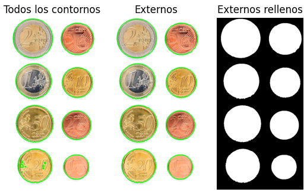
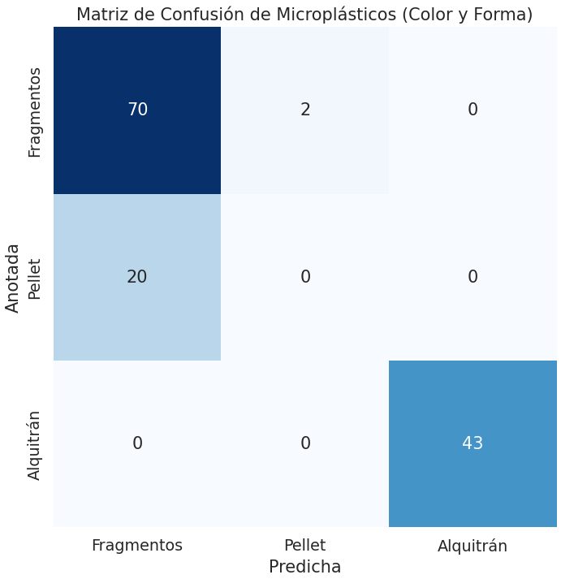

# Práctica 3. Detección y reconocimiento de formas
### Marcos Miguel Sánchez Antonio


### TAREA: Captura una o varias imágenes con monedas no solapadas. Tras visualizar la imagen, identifica de forma interactiva (por ejemplo haciendo clic en la imagen) una moneda de un valor determinado en la imagen (por ejemplo de 1€). Tras ello, la tarea se resuelve mostrando por pantalla el número de monedas y la cantidad de dinero presentes en la imagen.

Este apartado implementa un sistema interactivo que permite identificar, contar y calcular la cantidad total de dinero presente en una imagen que contiene monedas. El sistema utiliza procesamiento de imágenes con la biblioteca `OpenCV` y permite la selección interactiva de una moneda de referencia para establecer la escala de la imagen (en milímetros). A continuación, describe cómo funciona el sistema, las características implementadas y los posibles problemas observados.

## Funcionalidad

1. **Cargar la imagen**: El programa carga una imagen que contiene monedas distribuidas sobre una superficie sin solaparse.
2. **Segmentación de contornos**: Utiliza la técnica de detección de contornos para identificar formas circulares en la imagen que podrían corresponder a monedas.
3. **Interacción con el usuario**: El usuario selecciona una moneda haciendo clic sobre ella en la imagen. Esto permite que el sistema conozca el tamaño en milímetros de esa moneda para calcular la relación entre píxeles y milímetros.
4. **Clasificación de monedas**: A partir de la relación píxeles/mm, el sistema clasifica las monedas detectadas en la imagen y calcula su valor total.
5. **Resultado**: Se muestra el número total de monedas, el valor total en euros, y una clasificación detallada de las monedas por tipo (1 céntimo, 2 céntimos, etc.).



## Detalles

El sistema utiliza `OpenCV` para realizar las siguientes tareas clave:

1. **Suavizado de la imagen**: Se aplica un filtro Gaussiano para eliminar el ruido antes de la detección de contornos.
2. **Detección de contornos**: Se utiliza `cv2.findContours` para detectar los bordes de los objetos en la imagen. Los contornos externos son filtrados para aislar aquellos que tienen una forma redonda, lo que ayuda a identificar monedas.
3. **Redondez**: Para cada contorno, se calcula la relación entre el área y el perímetro, lo que permite descartar objetos que no son suficientemente redondos para ser monedas.
4. **Selección interactiva**: El usuario selecciona una moneda de referencia para determinar la relación entre píxeles y milímetros. La moneda seleccionada sirve como base para calcular el diámetro de las demás monedas.
5. **Clasificación de monedas**: Una vez que se calcula el diámetro de las monedas en milímetros, el sistema clasifica cada una utilizando los diámetros conocidos de las monedas en euros (por ejemplo, una moneda de 1€ tiene un diámetro de 23.25 mm).

| Moneda           | Diámetro (mm) 
|------------------|---------------
| 50 céntimos      | 24.25         
| 20 céntimos      | 22.25         
| 10 céntimos      | 19.75         
| 2 euros          | 25.75         
| 1 euro           | 23.25         
| 5 céntimos       | 21.25         
| 2 céntimos       | 18.75         
| 1 céntimo        | 16.25         

## Dependencias

Este proyecto requiere las siguientes bibliotecas:

- `OpenCV`: Para la detección de contornos y el procesamiento de imágenes.
- `Matplotlib`: Para mostrar las imágenes.
- `Numpy`: Para realizar cálculos numéricos.

Instala estas bibliotecas con:

```bash
pip install opencv-python matplotlib numpy
```

## Posibles Problemas Observados

1. **Superposición de monedas**: El sistema está diseñado para funcionar con monedas que no están solapadas. Si hay superposición entre monedas, los contornos pueden no ser detectados correctamente, lo que afectará la precisión de la clasificación.
   
2. **Objetos no deseados en la imagen**: Si la imagen contiene objetos adicionales que no son monedas, podrían ser identificados erróneamente como monedas, especialmente si tienen forma redondeada. Se podrían mejorar las técnicas de filtrado para evitar estos falsos positivos.

3. **Iluminación desigual**: Las sombras o iluminación no uniforme pueden interferir en la segmentación de los contornos. Se recomienda capturar imágenes con buena iluminación y sin sombras pronunciadas para obtener mejores resultados.

4. **Monedas dañadas o deformadas**: Si las monedas están muy gastadas o deformadas, el sistema puede no reconocer correctamente su contorno redondeado y su tamaño, afectando la precisión de la detección.

5. **Errores en la selección de la moneda de referencia**: Si el usuario no selecciona correctamente una moneda de referencia o selecciona un objeto que no es una moneda, la relación píxeles/mm se calculará de manera incorrecta, lo que afectará todo el proceso de clasificación.

4. **Nesidad de referencia para escalar**: El sistema requiere que el usuario seleccione una moneda de referencia conocida (como una moneda de 1€) para establecer una relación entre píxeles y milímetros


### TAREA: Las tres imágenes cargadas en la celda inicial, han sido extraidas de las imágenes de mayor tamaño presentes en la carpeta. La tarea consiste en extraer características (geométricas y/o visuales) e identificar patrones que permitan distinguir las partículas de cada una de las tres clases, evaluando los aciertos y fallos con las imágenes completas considerando las métricas mostradas y la matriz de confusión. La matriz de confusión, muestra para cada clase el número de muestras que se clasifican correctamente de dicha clase, y el número de muestras que se clasifican incorrectamente por cada una de las otras dos clases.

En esta tarea se implementa un sistema para la **detección y clasificación automática de microplásticos** en tres categorías: **fragmentos**, **pellets** y **alquitrán**. Utiliza técnicas de procesamiento de imágenes y aprendizaje automático para identificar, contar y clasificar las partículas presentes en imágenes, y evalúa el rendimiento mediante una **matriz de confusión**.

## Funcionalidad

1. **Cargar y procesar las imágenes**: El sistema carga imágenes de fragmentos, pellets y alquitrán, aplicando preprocesamiento para mejorar la calidad de las imágenes mediante umbralización y filtrado morfológico.
2. **Detección de contornos**: A partir de la imagen preprocesada, se detectan los contornos de las partículas.
3. **Extracción de características geométricas y visuales**: Se calculan propiedades como el área, perímetro, compacidad, relación ancho-alto, y relación de los ejes de la elipse ajustada.
4. **Clasificación de partículas**: Con base en las características extraídas, el sistema clasifica las partículas en fragmentos, pellets o alquitrán.
5. **Evaluación del rendimiento**: Se construye una **matriz de confusión** que compara las clasificaciones predichas con las anotaciones reales, mostrando los aciertos y errores para cada clase.
6. **Visualización de resultados**: Se muestran las imágenes procesadas con los contornos detectados y la matriz de confusión.

## Características Geométricas y Visuales Utilizadas

El sistema utiliza varias características geométricas y visuales para distinguir entre los diferentes tipos de microplásticos:

- **Área en píxeles**: La cantidad de píxeles que cubre una partícula.
- **Perímetro en píxeles**: La longitud total del borde de la partícula.
- **Compacidad**: Una medida que relaciona el área con el perímetro para evaluar cuán circular es un objeto.
- **Relación ancho/alto**: Relación entre el ancho y el alto del contorno delimitador de la partícula.
- **Relación de ejes**: Relación entre los ejes mayor y menor de la elipse ajustada a la partícula.
- **Brillo medio (HSV)**: Se usa para clasificar el alquitrán, ya que su valor de brillo en el espacio de color HSV tiende a ser muy bajo.

## Dependencias

Este proyecto requiere las siguientes bibliotecas:

- `OpenCV`: Para la detección de contornos y el procesamiento de imágenes.
- `Matplotlib`: Para mostrar las imágenes y la matriz de confusión.
- `Seaborn`: Para la visualización de la matriz de confusión.
- `Numpy`: Para cálculos numéricos y manipulación de matrices.

Instala las dependencias con el siguiente comando:

```bash
pip install opencv-python matplotlib seaborn numpy
```

## Posibles Problemas Observados

### 1. **Superposición de partículas**
   El sistema está diseñado para funcionar mejor con partículas que no se superponen. Si las partículas están solapadas, es probable que se detecten como un solo contorno, lo que afecta la clasificación.

### 2. **Objetos que no son partículas**
   Si la imagen contiene objetos adicionales que no son microplásticos, podrían ser clasificados incorrectamente. Por ejemplo, pequeñas burbujas o suciedad pueden ser detectadas como fragmentos debido a su forma irregular.

### 3. **Variaciones en la iluminación**
   Cambios significativos en la iluminación pueden afectar la umbralización de la imagen. Las sombras o los brillos intensos pueden hacer que las partículas no se detecten correctamente, o que se clasifiquen erróneamente.

### 4. **Necesidad de referencia para escalar**

   La **necesidad de establecer una referencia para escalar** es fundamental para interpretar correctamente las características geométricas de las partículas. Sin una escala conocida, las medidas en píxeles no pueden ser comparadas con tamaños físicos reales (como micrómetros o milímetros), lo que introduce varios problemas:

   - **Dependencia de la escala**: Para que las características como el área o el perímetro sean significativas, es necesario conocer la relación entre píxeles y una unidad de medida real. Esta relación no siempre es conocida, lo que puede hacer que las características extraídas sean erróneas.
   
   - **Variabilidad en las imágenes**: Las imágenes pueden tener diferentes resoluciones o tamaños según la cámara utilizada o el aumento del microscopio. Esto significa que el tamaño de las partículas en píxeles puede variar considerablemente entre imágenes, incluso si las partículas son del mismo tamaño real.
   
   - **Errores en la clasificación**: Sin una escala precisa, un pellet podría ser clasificado incorrectamente como un fragmento o viceversa, simplemente porque el área detectada en píxeles no corresponde al tamaño físico real.

   #### Posibles soluciones:
   - **Incluir una referencia en la imagen**: Colocar una regla o un objeto de tamaño conocido en las imágenes podría permitir calcular la relación píxeles/mm, ajustando las características geométricas a una escala real.
   - **Consistencia en la resolución**: Asegurarse de que todas las imágenes se capturen con la misma resolución y distancia focal puede reducir la variabilidad y hacer que las características sean más consistentes.
   - **Calibración automática**: Implementar un proceso de calibración donde el sistema detecte un objeto conocido en la imagen para establecer la escala automáticamente.

## Resultados Obtenidos

A continuación, se muestra la **matriz de confusión** obtenida tras aplicar el sistema a las imágenes de microplásticos. La matriz indica los aciertos y errores en la clasificación de **fragmentos**, **pellets**, y **alquitrán**:



#### Interpretación de la matriz:
- **Fragmentos**: De 72 partículas etiquetadas como fragmentos, 70 fueron correctamente clasificadas como fragmentos, mientras que 2 fueron clasificadas erróneamente como pellets.
- **Pellets**: De 20 partículas etiquetadas como pellets, todas fueron clasificadas erróneamente como fragmentos, lo que indica un problema en la detección o en las características utilizadas para distinguir pellets de fragmentos.
- **Alquitrán**: De 43 partículas etiquetadas como alquitrán, todas fueron correctamente clasificadas.

Esta matriz de confusión indica que el sistema tiene un buen rendimiento en la clasificación de **fragmentos** y **alquitrán**, pero necesita mejoras para diferenciar mejor los **pellets** de los fragmentos.

## Mejora Futuras

1. **Separación de partículas solapadas**: Implementar técnicas de separación de partículas solapadas (por ejemplo, `watershed` o segmentación basada en marcadores) para mejorar la clasificación cuando las partículas están muy juntas.
   
2. **Mejora de la detección de color**: Usar análisis de color más avanzado para distinguir mejor el alquitrán de otras partículas basándose en su aspecto oscuro característico.

3. **Calibración automática**: Desarrollar un mecanismo automático de calibración para ajustar la relación píxeles/mm sin intervención manual.

