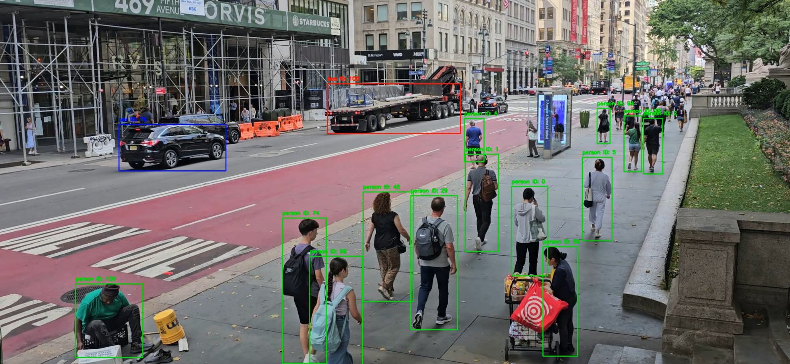
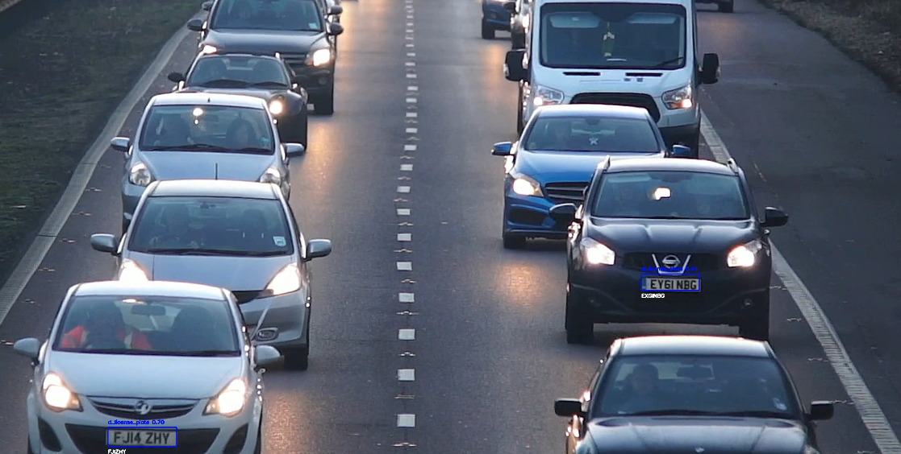
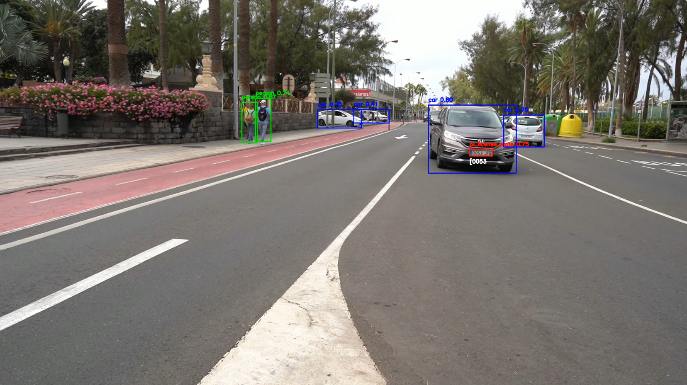

#

## Marcos Miguel Sánchez Antonio

### Detección con seguimiento

En el siguiente código se emplea el modelo YOLO para realizar detección de objetos y un método basado en el cálculo de IoU (Intersection over Union) para asignar un identificador único a cada objeto detectado, lo cual permite hacer un seguimiento continuo de los mismos en un video. A continuación, se describe detalladamente cómo funciona el proceso de detección y seguimiento:

```py
from ultralytics import YOLO
import cv2
import numpy as np
import csv

# Cargar el modelo YOLO
model = YOLO("yolov8n.pt")

# Ruta del video de entrada y salida
video_path = "./video-samples/12066183_2320_1080_30fps.mp4"
output_path = "output_coches_personas_tracked.mp4"
csv_output_path = "detections_tracking.csv"

# Configuración de captura de video
cap = cv2.VideoCapture(video_path)
fourcc = cv2.VideoWriter_fourcc(*'mp4v')
out = cv2.VideoWriter(output_path, fourcc, 30.0, (int(cap.get(3)), int(cap.get(4))))

# Clases a detectar
target_classes = [0, 2, 5, 7]

# Colores para cada clase
colors = {
    0: (0, 255, 0),     # Persona - Verde
    2: (255, 0, 0),     # Coche - Azul
    5: (0, 0, 255),     # Autobús - Rojo
    7: (255, 255, 0)    # Camión - Amarillo
}

# Diccionario de objetos rastreados {obj_id: [x1, y1, x2, y2, clase]}
tracked_objects = {}
next_object_id = 0  # ID único para cada objeto rastreado

# Diccionario para contar cada clase detectada
class_counts = {class_id: 0 for class_id in target_classes}

# Inicializar el archivo CSV y escribir el encabezado
with open(csv_output_path, mode='w', newline='') as file:
    writer = csv.writer(file)
    writer.writerow([
        "fotograma", "tipo_objeto", "confianza", "identificador_tracking",
        "x1", "y1", "x2", "y2", "matrícula_en_su_caso", "confianza_matricula",
        "mx1", "my1", "mx2", "my2", "texto_matricula"
    ])

def calculate_iou(box1, box2):
    """Calcula el IOU entre dos cuadros delimitadores."""
    x1, y1, x2, y2 = box1
    x1_p, y1_p, x2_p, y2_p = box2

    # Calcular las coordenadas de la intersección
    xi1, yi1 = max(x1, x1_p), max(y1, y1_p)
    xi2, yi2 = min(x2, x2_p), min(y2, y2_p)
    inter_area = max(0, xi2 - xi1) * max(0, yi2 - yi1)

    # Calcular las áreas de los cuadros y la unión
    box1_area = (x2 - x1) * (y2 - y1)
    box2_area = (x2_p - x1_p) * (y2_p - y1_p)
    union_area = box1_area + box2_area - inter_area

    # Calcular el IOU
    iou = inter_area / union_area if union_area > 0 else 0
    return iou

frame_count = 0  # Contador de fotogramas

while cap.isOpened():
    ret, frame = cap.read()
    if not ret:
        break
    frame_count += 1

    # Realizar la detección en el cuadro actual en la GPU
    results = model.predict(source=frame, imgsz=640, conf=0.4, device="cuda")

    # Almacenar las detecciones actuales
    current_detections = []

    for result in results:
        for box in result.boxes:
            class_id = int(box.cls[0])  # ID de la clase
            confidence = box.conf[0]    # Confianza de la detección

            # Filtrar solo vehículos y personas
            if class_id in target_classes:
                # Obtener las coordenadas del cuadro delimitador
                x1, y1, x2, y2 = map(int, box.xyxy[0])
                current_detections.append((x1, y1, x2, y2, class_id, confidence))

    # Asignar IDs a las detecciones usando IOU
    updated_tracked_objects = {}
    for (x1, y1, x2, y2, class_id, confidence) in current_detections:
        best_match_id = None
        highest_iou = 0.5  # Umbral mínimo para considerar que es el mismo objeto

        # Buscar el mejor ID de coincidencia basado en IOU
        for obj_id, (prev_x1, prev_y1, prev_x2, prev_y2, prev_class_id) in tracked_objects.items():
            if class_id == prev_class_id:  # Comparar solo objetos de la misma clase
                iou = calculate_iou((x1, y1, x2, y2), (prev_x1, prev_y1, prev_x2, prev_y2))
                if iou > highest_iou:
                    best_match_id = obj_id
                    highest_iou = iou

        # Si encontramos una coincidencia, actualizarla; de lo contrario, crear un nuevo ID
        if best_match_id is not None:
            updated_tracked_objects[best_match_id] = (x1, y1, x2, y2, class_id)
        else:
            updated_tracked_objects[next_object_id] = (x1, y1, x2, y2, class_id)
            best_match_id = next_object_id
            next_object_id += 1

            # Aumentar el conteo para la clase detectada
            class_counts[class_id] += 1

        # Dibujar el cuadro delimitador y el ID de seguimiento
        color = colors.get(class_id, (0, 255, 0))  # Color basado en la clase
        label = model.names[class_id]  # Nombre de la clase
        cv2.rectangle(frame, (x1, y1), (x2, y2), color, 2)
        cv2.putText(frame, f"{label} ID: {best_match_id}", (x1, y1 - 10), cv2.FONT_HERSHEY_SIMPLEX, 0.5, color, 2)

        # Escribir la información en el archivo CSV
        with open(csv_output_path, mode='a', newline='') as file:
            writer = csv.writer(file)
            writer.writerow([
                frame_count, model.names[class_id], confidence, best_match_id,
                x1, y1, x2, y2, "", "", "", "", "", ""
            ])

    # Actualizar los objetos rastreados
    tracked_objects = updated_tracked_objects

    # Guardar el cuadro procesado en el video de salida
    out.write(frame)

# Liberar recursos
cap.release()
out.release()

# Mostrar el conteo total de cada clase detectada
for class_id, count in class_counts.items():
    class_name = model.names[class_id]
    print(f"Total de '{class_name}': {count}")

```

[Video con seguimiento de detecciones](https://alumnosulpgc-my.sharepoint.com/:v:/g/personal/marcos_sanchez107_alu_ulpgc_es/EVhq9my9dLFKqEKIch-7t9MBZrCSxLKECSrmaz-4Oo8R8Q?nav=eyJyZWZlcnJhbEluZm8iOnsicmVmZXJyYWxBcHAiOiJPbmVEcml2ZUZvckJ1c2luZXNzIiwicmVmZXJyYWxBcHBQbGF0Zm9ybSI6IldlYiIsInJlZmVycmFsTW9kZSI6InZpZXciLCJyZWZlcnJhbFZpZXciOiJNeUZpbGVzTGlua0NvcHkifX0&e=BdNVPX)



#### 1. Configuración Inicial

- **Modelo YOLO**: Se carga un modelo YOLOv8 preentrenado para la detección de objetos, específico para identificar personas, coches, autobuses y camiones.
- **Video y Archivos de Salida**: Se configura la ruta del video de entrada, el archivo de video procesado de salida, y un archivo CSV donde se almacenarán las detecciones y el seguimiento de cada objeto.
- **Clases Objetivo y Colores**: Se especifican las clases que se desean detectar y un color para cada clase, lo cual facilita su visualización en el video procesado.
- **Seguimiento de Objetos**: Se inicializan dos estructuras de datos importantes:
  - `tracked_objects`, un diccionario que almacena los objetos rastreados junto con sus coordenadas y la clase a la que pertenecen.
  - `class_counts`, un diccionario para contar el número total de detecciones para cada clase.

#### 2. Función `calculate_iou`

Esta función es fundamental para el seguimiento, ya que calcula el IoU (Intersection over Union) entre dos cuadros delimitadores. El IoU representa el área de superposición entre dos cuadros con respecto a su área combinada y se utiliza para determinar si dos detecciones en fotogramas consecutivos corresponden al mismo objeto.


#### 3. Bucle Principal de Procesamiento

El bucle que procesa cada fotograma del video se estructura de la siguiente manera:

1. **Detección de Objetos en el Fotograma**: 
   - El modelo YOLO realiza una predicción sobre el fotograma actual, detectando los objetos presentes y guardando sus coordenadas, la clase a la que pertenecen, y la confianza de la detección en una lista llamada `current_detections`.
   
2. **Asignación de IDs de Seguimiento usando IoU**:
   - Para cada objeto detectado en el fotograma actual, el código intenta encontrar una coincidencia con objetos detectados en el fotograma anterior.
   - La coincidencia se basa en el IoU: si un objeto actual tiene un IoU alto con un objeto en el fotograma anterior y ambos son de la misma clase, se considera que es el mismo objeto.
   - Si el objeto detectado tiene una coincidencia válida, se le asigna el mismo identificador (`ID de seguimiento`). Si no hay coincidencia, se genera un nuevo ID y se añade el objeto a `tracked_objects`.

3. **Dibujar Cuadros y Etiquetas en el Video**:
   - Para cada detección, el código dibuja un cuadro delimitador con el color correspondiente a la clase del objeto y muestra la clase y el ID de seguimiento sobre el cuadro.
   
4. **Almacenamiento de Información en el CSV**:
   - Cada vez que se asigna un ID de seguimiento, los detalles del objeto (fotograma, tipo de objeto, confianza, identificador, coordenadas) se guardan en el archivo CSV. Esto permite que, al final del procesamiento, haya un registro detallado de todos los objetos detectados y seguidos a lo largo del video.

#### 4. Actualización y Almacenamiento

- Al final de cada fotograma, `tracked_objects` se actualiza con los objetos actualmente rastreados. El fotograma procesado se guarda en el archivo de video de salida.
- Después de procesar todos los fotogramas, se libera la captura de video y se imprime el conteo total de cada clase detectada.


### Deteccion de objetos con detección de matriculas y OCR

Este código utiliza modelos de detección y reconocimiento óptico para identificar y rastrear personas y vehículos en un video, así como para detectar y leer matrículas. A lo largo de su ejecución, también almacena los resultados en un archivo de video y guarda un archivo CSV con los detalles de cada detección, facilitando un análisis detallado de los elementos presentes en el video.

```py
from ultralytics import YOLO
import cv2
import easyocr
import pandas as pd

# Inicialización de modelos
yolo_model_person_car = YOLO('yolov8n.pt')  # Modelo YOLOv8 para detección de personas y coches
license_plate_model = YOLO('/home/0xm4rc/Desktop/VC/Ejercicios Practicas/Practica4/runs/detect/train2/weights/last.pt')
reader = easyocr.Reader(['en'])  # OCR en inglés

# Configuración de video y CSV
video_path = "/home/0xm4rc/Downloads/C0142.MP4"
output_video_path = "output_video_with_license_plates_final.mp4"
output_csv_path = "detections_tracking.csv"

# Configuración de captura de video
cap = cv2.VideoCapture(video_path)
fourcc = cv2.VideoWriter_fourcc(*'mp4v')
out = cv2.VideoWriter(output_video_path, fourcc, 30.0, (int(cap.get(3)), int(cap.get(4))))

# Parámetros para conteo y almacenamiento de resultados
data = []
object_counts = {"person": 0, "car": 0}

# Diccionario para nombres de clases y colores
class_names_yolo = {0: 'person', 2: 'car'}
class_names_license = {0: 'd_license_plate', 1: 'pl_license_plate'}
colors_yolo = {
    0: (0, 255, 0),   # Verde para personas
    2: (255, 0, 0)    # Azul para coches
}
colors_license = {
    0: (255, 0, 0),  # Azul para d_license_plate
    1: (0, 0, 255)   # Rojo para pl_license_plate
}

# Inicialización de identificador de seguimiento
tracker_id_counter = 0
trackers = {}

while cap.isOpened():
    ret, frame = cap.read()
    if not ret:
        break

    frame_number = int(cap.get(cv2.CAP_PROP_POS_FRAMES))

    # Detección de personas y coches usando YOLOv8
    results_person_car = yolo_model_person_car.predict(source=frame, imgsz=640, conf=0.4, device="cuda")

    # Procesa detecciones de personas y coches
    for result in results_person_car:
        for box in result.boxes:
            class_id = int(box.cls[0])  # ID de la clase detectada
            confidence = box.conf[0]    # Confianza de la detección

            # Filtrar solo personas y coches
            if class_id in class_names_yolo.keys():
                # Obtener coordenadas del cuadro delimitador
                x1, y1, x2, y2 = map(int, box.xyxy[0])

                # Asignar color y nombre de clase
                color = colors_yolo[class_id]
                label = class_names_yolo[class_id]
                object_counts[label] += 1

                # Dibuja el cuadro y etiqueta en el video
                cv2.rectangle(frame, (x1, y1), (x2, y2), color, 2)
                cv2.putText(frame, f"{label} {confidence:.2f}", (x1, y1 - 10), cv2.FONT_HERSHEY_SIMPLEX, 0.5, color, 2)

                # Generar identificador de seguimiento
                tracker_id = trackers.get((x1, y1, x2, y2), tracker_id_counter)
                if tracker_id == tracker_id_counter:
                    tracker_id_counter += 1
                trackers[(x1, y1, x2, y2)] = tracker_id

                # Si se detecta un coche, se realiza detección de matrícula
                if class_id == 2:
                    car_region = frame[y1:y2, x1:x2]
                    results_license = license_plate_model.predict(source=car_region, imgsz=640, conf=0.4, device="cuda")

                    # Procesa detección de matrículas
                    for license_result in results_license:
                        for license_box in license_result.boxes:
                            license_class_id = int(license_box.cls[0])
                            license_conf = license_box.conf[0]

                            # Filtrar solo clases de matrículas
                            if license_class_id in class_names_license.keys():
                                lx1, ly1, lx2, ly2 = map(int, license_box.xyxy[0])
                                lx1, lx2 = lx1 + x1, lx2 + x1
                                ly1, ly2 = ly1 + y1, ly2 + y1

                                license_color = colors_license[license_class_id]
                                license_label = class_names_license[license_class_id]

                                # Dibuja el cuadro de la matrícula y etiqueta
                                cv2.rectangle(frame, (lx1, ly1), (lx2, ly2), license_color, 2)
                                cv2.putText(frame, f"{license_label} {license_conf:.2f}", (lx1, ly1 - 10), cv2.FONT_HERSHEY_SIMPLEX, 0.5, license_color, 2)

                                # OCR para la matrícula
                                license_plate_img = frame[ly1:ly2, lx1:lx2]
                                results_ocr = reader.readtext(license_plate_img)
                                detected_text = ""
                                if results_ocr:
                                    detected_text = results_ocr[0][1]
                                    print("Matrícula detectada:", detected_text)
                                    cv2.putText(frame, detected_text, (lx1, ly2 + 20), cv2.FONT_HERSHEY_SIMPLEX, 0.5, (255, 255, 255), 2)

                                # Almacenar datos de detección y seguimiento en la lista de datos
                                data.append({
                                    "fotograma": frame_number,
                                    "tipo_objeto": label,
                                    "confianza": confidence,
                                    "identificador_tracking": tracker_id,
                                    "x1": x1, "y1": y1, "x2": x2, "y2": y2,
                                    "matrícula_en_su_caso": license_label if license_class_id in [0, 1] else None,
                                    "confianza_matrícula": license_conf if license_class_id in [0, 1] else None,
                                    "mx1": lx1 if license_class_id in [0, 1] else None,
                                    "my1": ly1 if license_class_id in [0, 1] else None,
                                    "mx2": lx2 if license_class_id in [0, 1] else None,
                                    "my2": ly2 if license_class_id in [0, 1] else None,
                                    "texto_matricula": detected_text if license_class_id in [0, 1] else None
                                })

    # Escribe el cuadro procesado en el video de salida
    out.write(frame)

# Guardar resultados en CSV
df = pd.DataFrame(data)
df.to_csv(output_csv_path, index=False)

# Liberar recursos
cap.release()
out.release()

print(f"Conteo total de objetos: {object_counts}")
print(f"Resultados guardados en {output_csv_path}")
print("Proceso completado.")
```

[Video detector de matriculas con OCR](https://alumnosulpgc-my.sharepoint.com/:v:/g/personal/marcos_sanchez107_alu_ulpgc_es/EZbT5Oh1umBClYU-vw__qsUBJgQapiDqtQwdxxuxhOJGjQ?nav=eyJyZWZlcnJhbEluZm8iOnsicmVmZXJyYWxBcHAiOiJPbmVEcml2ZUZvckJ1c2luZXNzIiwicmVmZXJyYWxBcHBQbGF0Zm9ybSI6IldlYiIsInJlZmVycmFsTW9kZSI6InZpZXciLCJyZWZlcnJhbFZpZXciOiJNeUZpbGVzTGlua0NvcHkifX0&e=2zi7Wv)



[Video aportado por el profesor usando el detector ](https://alumnosulpgc-my.sharepoint.com/:v:/g/personal/marcos_sanchez107_alu_ulpgc_es/EYDZIi7AIbRPp2A-jcd7mtwBLapDZAggiOU-LN4-_aD48w?nav=eyJyZWZlcnJhbEluZm8iOnsicmVmZXJyYWxBcHAiOiJPbmVEcml2ZUZvckJ1c2luZXNzIiwicmVmZXJyYWxBcHBQbGF0Zm9ybSI6IldlYiIsInJlZmVycmFsTW9kZSI6InZpZXciLCJyZWZlcnJhbFZpZXciOiJNeUZpbGVzTGlua0NvcHkifX0&e=GFLmdc)



#### 1. Configuración de Librerías y Modelos

Al inicio, el código importa las librerías necesarias: `ultralytics` para el modelo YOLO, `cv2` de OpenCV para manipulación de video, `easyocr` para reconocimiento óptico de caracteres (OCR), y `pandas` para el manejo de datos en formato de tabla.

Luego, se inicializan dos modelos de YOLO:
- **`yolo_model_person_car`**: Un modelo YOLOv8 preentrenado para detectar personas y coches en el video.
- **`license_plate_model`**: Un modelo adicional YOLO, personalizado para detectar matrículas. 

También se configura `easyocr.Reader` para detectar texto en inglés, permitiendo así el reconocimiento de caracteres en las matrículas.

#### 2. Preparación del Video y del Almacenamiento de Resultados

Se configuran los archivos de entrada y salida:
- **Video de entrada**: Indicado en `video_path`, que es el video a procesar.
- **Video de salida**: Se crea un archivo de video en `output_video_path` donde se guardarán los cuadros procesados.
- **Archivo CSV de resultados**: La ruta `output_csv_path` almacena los datos de detección, como el tipo de objeto, coordenadas, y matrículas detectadas.

Adicionalmente, se configuran estructuras de datos para el conteo de objetos y el almacenamiento de información detallada sobre cada detección, que se usará para generar el CSV al final del procesamiento.

#### 3. Parámetros de Visualización

Cada tipo de objeto y matrícula tiene asignado un color específico que facilita su identificación visual en el video:
- **`class_names_yolo`** y **`colors_yolo`**: Asocian nombres y colores a las clases “person” y “car”.
- **`class_names_license`** y **`colors_license`**: Asignan colores para los tipos de matrícula detectados por el modelo de detección de matrículas.

#### 4. Bucle Principal de Detección y Seguimiento

El procesamiento del video se realiza en un bucle que lee cada fotograma:
1. **Detección de personas y coches**: En cada cuadro, el modelo `yolo_model_person_car` detecta objetos, y si alguno corresponde a una persona o a un coche, extrae las coordenadas y asigna un color y una etiqueta a cada objeto.
2. **Generación de identificadores de seguimiento**: Se asigna un identificador único para cada detección. Esto permite rastrear cada persona o vehículo a lo largo de los fotogramas.

#### 5. Detección de Matrículas

Si el objeto detectado es un coche, el código extrae la región de imagen correspondiente al coche y la pasa al modelo `license_plate_model` para detectar posibles matrículas:
1. **Detección de cuadros de matrícula**: El modelo detecta cuadros dentro del área del coche donde puede estar la matrícula, y cada cuadro recibe una etiqueta y un color específicos.
2. **Reconocimiento de texto**: Para cada cuadro de matrícula, el código utiliza EasyOCR para intentar leer el texto de la matrícula. Si se detecta texto, se dibuja en el cuadro y se guarda en la estructura de datos.

#### 6. Almacenamiento de Resultados

Cada detección, incluyendo tipo de objeto, coordenadas, matrícula detectada (si aplica), y su texto reconocido, se guarda en una lista de datos:
- **Video de salida**: Cada fotograma procesado, con los cuadros y etiquetas dibujados, se escribe en `output_video_path`.
- **CSV de resultados**: Al final del procesamiento, los datos se exportan a un archivo CSV que contiene columnas como `fotograma`, `tipo_objeto`, `confianza`, `identificador_tracking`, `x1`, `y1`, `x2`, `y2`, y el texto de la matrícula (si corresponde).

#### 7. Finalización

Finalmente, se liberan los recursos de captura y escritura de video, y el código imprime un resumen con el conteo total de personas y coches detectados, junto con un mensaje indicando la finalización del proceso y la ubicación de los archivos generados.

