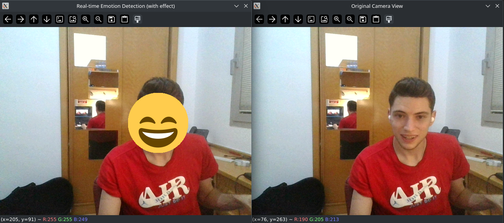
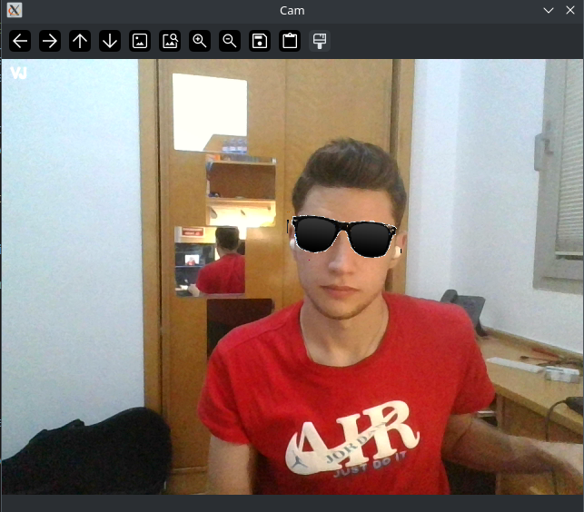

## Práctica 5. Detección y caracterización de caras

#### Marcos Miguel Sánchez Antonio

### Filtro 1: Emoji cambiante según estado de ánimo

Este filtro permite detectar rostros en tiempo real a través de la cámara, que al analizar la emoción expresada, superpone un emoji equivalente a esa emoción sobre esa cara detectada.

El proceso del filtro sigue estos pasos:

  1.  Preparación de los emojis: El filtro utiliza archivos SVG de emojis que representan diversas emociones (feliz, triste, enojado, etc.). Para que estos archivos sean compatibles con OpenCV, primero los convierto en imágenes PNG y los redimensiono ligeramente para que cubran mejor el área del rostro detectado.

  2.  Detección de rostros: Con el clasificador Haar Cascade de OpenCV, el filtro identifica los rostros presentes en cada cuadro capturado por la cámara, permitiendo realizar el análisis de cada rostro de manera individual.

  3. Análisis de emociones: Una vez detectado un rostro, se toma esa región de la imagen y se analiza con DeepFace, una librería de reconocimiento facial que identifica la emoción dominante (como feliz, triste, enojado, etc.).

  4. Superposición del emoji: Dependiendo de la emoción detectada, el filtro selecciona el emoji correspondiente y lo coloca sobre el rostro, utilizando el canal alpha de la imagen PNG para que el emoji se integre adecuadamente con el fondo del video.

  5. Visualización en tiempo real: El programa muestra dos ventanas: una con el video en tiempo real con los emojis superpuestos y otra con la imagen original de la cámara. El filtro permanece activo hasta que se presiona la tecla ‘q’ para finalizar.

### Filtro 2: Gafas de sol con rotación

En este segundo filtro, se superponen unas gafas sobre los ojos de una persona en tiempo real, utilizando OpenCV para el procesamiento de video y dos varias librerías como FaceDetector para la detección de rostros y ojos.

Aquí está el flujo básico de cómo funciona:

  1. Carga y preparación de los recursos:
      Se carga una imagen de gafas que incluye transparencia (canal alpha), lo cual permite que el filtro se superponga sobre el rostro sin bloquear completamente la imagen de fondo.

  2. Detección de rostros y ojos:
      Con FaceDetector, el filtro identifica el rostro y los ojos en cada cuadro de la cámara. Esto se hace en tiempo real, lo que permite adaptar la posición de las gafas conforme la persona se mueve.

  3. Calibración de las gafas:
      Una vez detectados los ojos, el filtro calcula el centro entre ellos para tener una referencia central sobre la cual colocar las gafas.
      Se define un factor de escala (scale_factor) que determina el tamaño de las gafas en relación con la distancia entre los ojos, lo que permite ajustar automáticamente el tamaño de las gafas según la cercanía de la persona a la cámara.

  4. Rotación y alineación de las gafas:
      El filtro calcula el ángulo de inclinación entre los ojos para rotar las gafas de manera que queden alineadas con el rostro.
      Usando la matriz de rotación de OpenCV, rota las gafas según el ángulo necesario para que se ajusten adecuadamente.

  5. Superposición de las gafas en el video:
      Finalmente, las gafas se colocan en el área correspondiente de la imagen del video. Gracias al canal alpha de la imagen de las gafas, el filtro asegura que solo las partes opacas de las gafas se dibujen, sin cubrir completamente el fondo.

  6. Opciones de control:
      El filtro muestra la salida en tiempo real y se cierra al presionar ‘Esc’.

